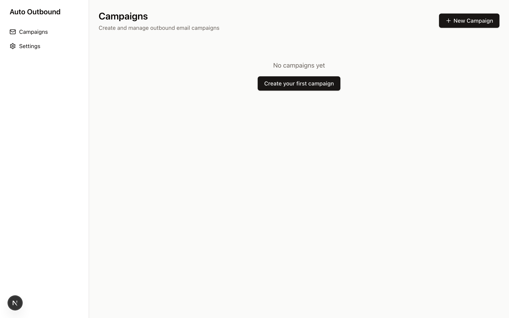
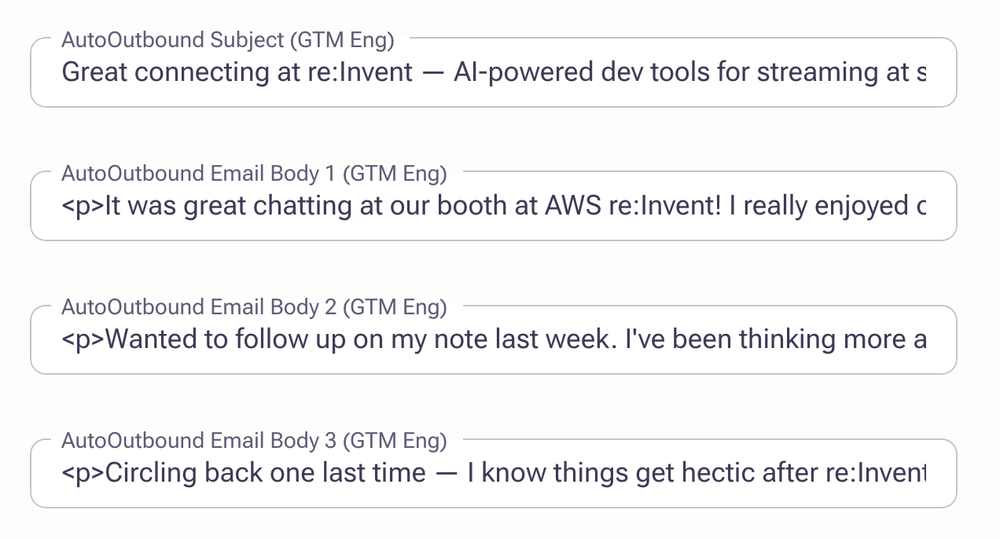
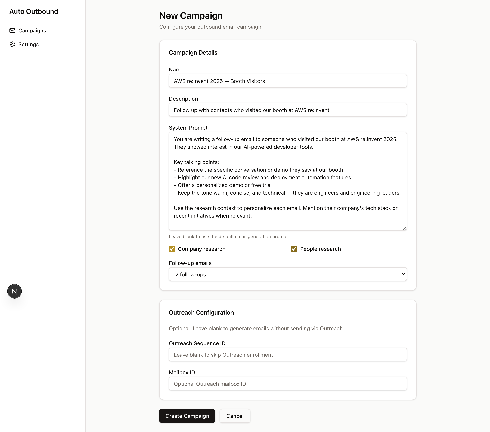
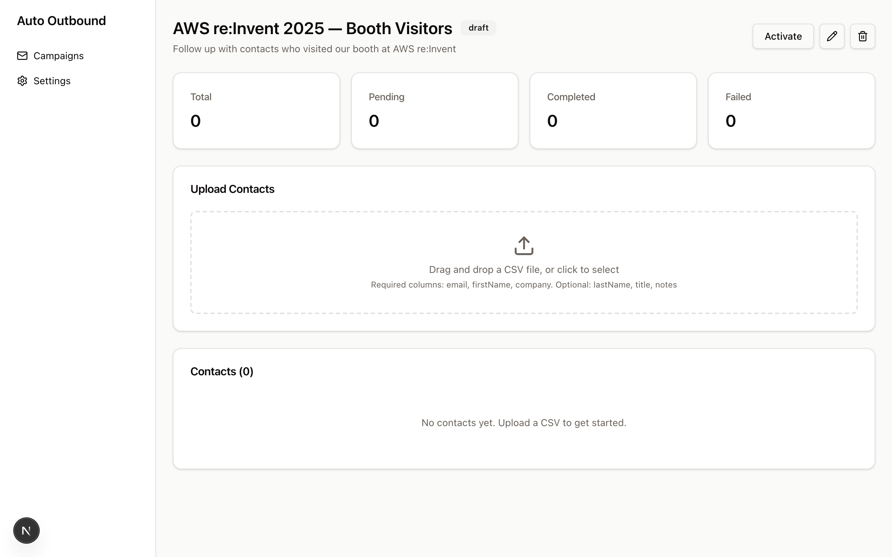
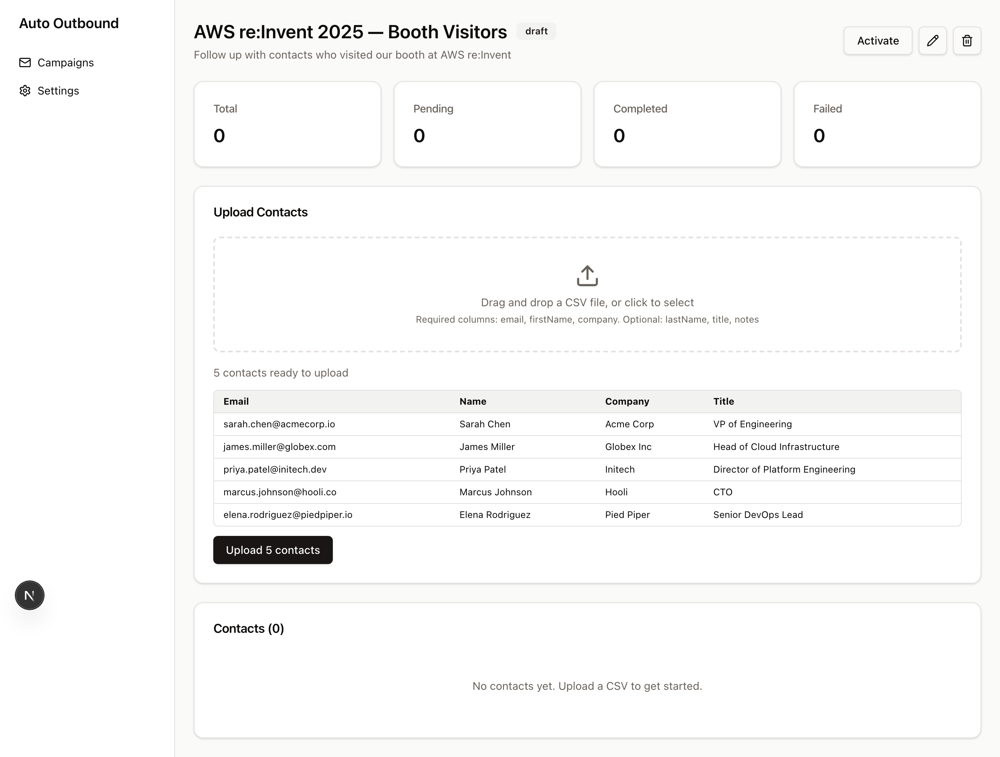
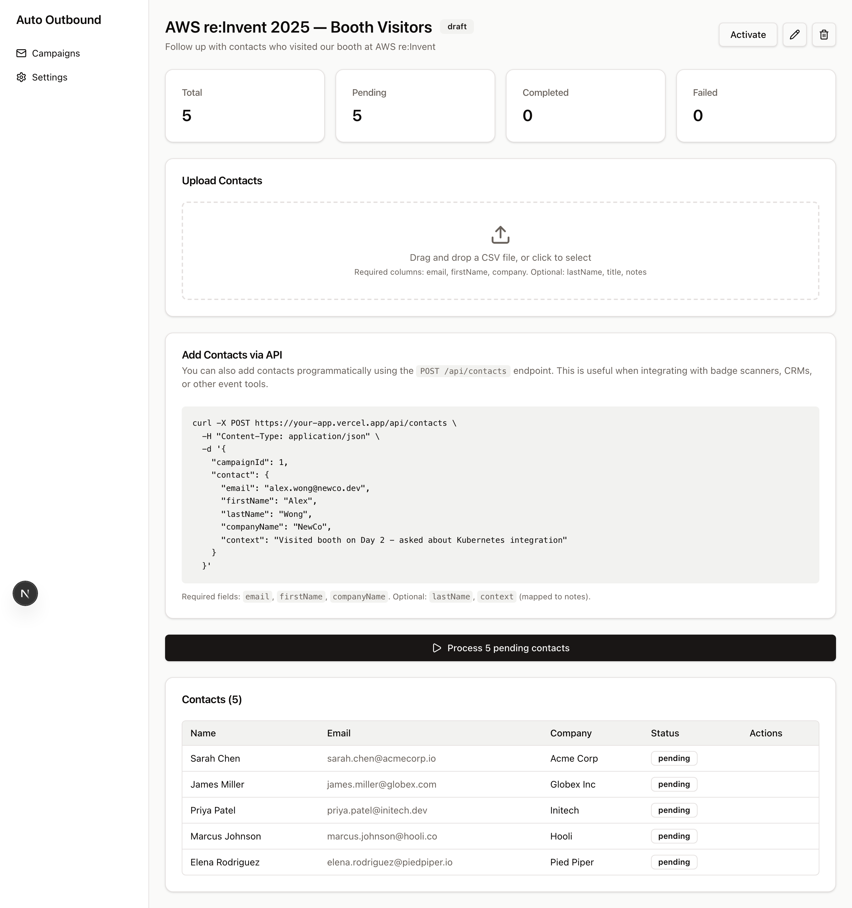
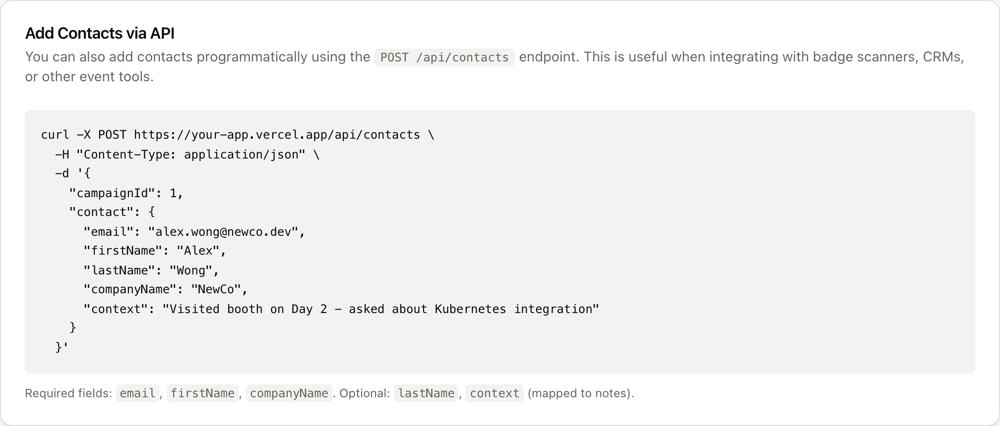

# Email Agent

AI-powered outbound email generation with Exa research context and Outreach integration. One-click deploy to Vercel.

[](https://vercel.com/new/clone?repository-url=https%3A%2F%2Fgithub.com%2Fvercel-labs%2Fauto-outbound&env=AI_GATEWAY_API_KEY,EXA_API_KEY,DATABASE_URL,OUTREACH_CLIENT_ID,OUTREACH_CLIENT_SECRET,OUTREACH_REDIRECT_URI&envDescription=Help%20gathering%20these%20environment%20variables%20is%20available%20on%20the%20auto-outbound%20README&envLink=https%3A%2F%2Fgithub.com%2Fvercel-labs%2Fauto-outbound%23setup)

## What it does

1. **Create a campaign** with a custom AI prompt and research toggles
2. **Upload contacts** via CSV (email, firstName, company required)
3. **Process contacts** - for each contact:
   - Research the company via Exa (AI features, company summary)
   - Optionally research the person (title, activity, verification)
   - Generate personalized email sequence via AI
   - Optionally enroll in Outreach sequence

## Setup

Deploy to Vercel first, then complete the steps below.

- [ ] **Set API keys** — After deploy, add these environment variables in your Vercel project settings:
  - `AI_GATEWAY_API_KEY` — Vercel AI Gateway key
  - `EXA_API_KEY` — [Exa](https://exa.ai) API key for research
- [ ] **Set up the database** — Add a Neon Postgres database via the [Vercel Neon integration](https://vercel.com/marketplace/neon). This automatically sets `DATABASE_URL` in your environment.
- [ ] **Run database migrations** — Once `DATABASE_URL` is set, run:
  ```bash
  pnpm db:push
  ```
  This creates 4 tables: `campaigns`, `contacts`, `oauth_tokens`, `settings`.
- [ ] **Connect Outreach** — To enable sequence enrollment, create an OAuth app in your [Outreach developer account](https://developers.outreach.io/) and add these environment variables:
  - `OUTREACH_CLIENT_ID` — from your Outreach OAuth app
  - `OUTREACH_CLIENT_SECRET` — from your Outreach OAuth app
  - `OUTREACH_REDIRECT_URI` — set to `https://<your-domain>/api/oauth/outreach/callback`
  - Navigate to our `/settings` page in Email Agent and connect Outreach via OAuth

## Setting Up Your First AI Outbound Campaign

This walkthrough creates an example campaign to follow up with people who visited your booth at AWS re:Invent.

### Step 1: Create a Campaign

From the campaigns list, click **New Campaign**.



Fill in the campaign details:

- **Name**: `AWS re:Invent 2025 — Booth Visitors`
- **Description**: `Follow up with contacts who visited our booth at AWS re:Invent`
- **System Prompt**: Write instructions that tell the AI how to generate emails. For a conference follow-up, you might include talking points about the demos they saw, your product's key features, and the tone you want (warm, technical, concise).
- **Research toggles**: Enable both **Company research** and **People research** so the AI can personalize each email with context about the recipient's company and role.
- **Follow-up emails**: Set to **2 follow-ups** for a 3-touch sequence.
- **Outreach integration**: Choose how generated emails are delivered. There are three levels:

  | Mode | What happens | Outreach required? |
  |---|---|---|
  | **Keep in Email Agent only** (`none`) | Emails are generated and stored in the app. Nothing is sent to Outreach. | No |
  | **Sync prospects to Outreach** (`upsert_only`) | Creates or updates the prospect in Outreach and writes the generated emails to custom fields on the prospect record. SDRs can review and send manually. | Yes |
  | **Sync and enroll in sequence** (`full`) | Everything in "Sync prospects" plus automatic enrollment in an Outreach sequence. Requires an Outreach Sequence ID. | Yes |

  When using either Outreach mode, the generated subject and email bodies are written to custom fields on the prospect so they're visible directly in Outreach:

  



Click **Create Campaign** to save. You'll land on the campaign detail page.



### Step 2: Add Contacts via CSV

The fastest way to add contacts is by uploading a CSV file. The required columns are `email`, `firstName`, and `company`. Optional columns include `lastName`, `title`, and `notes`.

An [`example-contacts.csv`](example-contacts.csv) is included in this repo:

```csv
email,firstName,lastName,company,title,notes
sarah.chen@acmecorp.io,Sarah,Chen,Acme Corp,VP of Engineering,Met at AWS re:Invent booth - interested in our AI features
james.miller@globex.com,James,Miller,Globex Inc,Head of Cloud Infrastructure,Stopped by booth during keynote break - asked about pricing
priya.patel@initech.dev,Priya,Patel,Initech,Director of Platform Engineering,Scanned badge at demo station - watched full product walkthrough
marcus.johnson@hooli.co,Marcus,Johnson,Hooli,CTO,Asked about enterprise plan and SOC2 compliance
elena.rodriguez@piedpiper.io,Elena,Rodriguez,Pied Piper,Senior DevOps Lead,Interested in migration tooling - currently on legacy stack
```

Drag and drop the CSV (or click to select it) in the **Upload Contacts** area. You'll see a preview table before committing.



Click **Upload 5 contacts** to import them.



### Step 3: Add Contacts via API

You can also add contacts programmatically using the `POST /api/contacts` endpoint. This is useful when integrating with badge scanners, CRMs, or other event tools. The campaign detail page includes a ready-to-use curl example with your campaign ID pre-filled:



```bash
curl -X POST https://your-app.vercel.app/api/contacts \
  -H "Content-Type: application/json" \
  -d '{
    "campaignId": 1,
    "contact": {
      "email": "alex.wong@newco.dev",
      "firstName": "Alex",
      "lastName": "Wong",
      "companyName": "NewCo",
      "context": "Visited booth on Day 2 - asked about Kubernetes integration"
    }
  }'
```

The required fields are `email`, `firstName`, and `companyName`. Optional fields are `lastName` and `context` (mapped to notes).

### Step 4: Process Contacts

Once your contacts are loaded, click the **Process N pending contacts** button. For each contact, Email Agent will:

1. Research their company (and optionally the person) via Exa
2. Generate a personalized email sequence using your system prompt and the research context
3. Optionally enroll them in an Outreach sequence (if configured)

You can monitor progress in the contacts table — each contact moves through `pending` → `researching` → `generating` → `completed` (or `failed`).

> **Tip:** For quick local testing, use the included [`scripts/test-contact.sh`](scripts/test-contact.sh) to add a sample contact and kick off processing without needing a CSV or curl one-liner.

## Technical Breakdown

### Architecture Overview

Email Agent is a Next.js 15 App Router application that combines server-rendered pages with client-side interactivity via React Query. Data is persisted in Neon Postgres through Drizzle ORM, and long-running contact processing runs as durable Vercel Workflows.

### Request Flow

```
Browser → Next.js Server Component (SSR) → Drizzle ORM → Neon Postgres
              ↓ (hydrates client)
         React Query (polling, mutations) → Server Actions → Drizzle ORM → Neon Postgres
```

### Core Workflow: Contact Processing

When contacts are uploaded or the "Process" button is clicked, each contact goes through a durable Vercel Workflow (`workflows/process-contact.ts`) with these steps:

```
1. Load contact + campaign from DB
2. Research company via Exa API → summarized by GPT-4o-mini
3. (Optional) Research person via Exa API → verified by GPT-4o-mini
4. Save research results to DB
5. Generate personalized email sequence (subject + 1-3 bodies) via GPT-4o
6. Save generated emails to DB
7. (Optional) Upsert prospect in Outreach CRM
8. (Optional) Set custom fields + add to Outreach sequence
```

Each step is individually retryable. Contact status transitions through: `pending` → `researching` → `generating` → `sending` → `completed` (or `failed` at any step).

### Data Fetching & State Management

**React Query** manages all client-side data:

- **Queries** fetch campaign details and contact lists via server actions, with automatic polling (every 3s) when any contacts are in a processing state (`researching`, `generating`, `sending`)
- **Mutations** handle CSV upload, contact processing, campaign activation, and deletion — each invalidates the relevant query keys on success
- **Initial data** is passed from server components via SSR props, so the page is fully rendered on first load with no loading spinners
- **Query keys** are centralized in `lib/query-keys.ts` for consistency across components

### Key Directories

| Path | Purpose |
|---|---|
| `app/` | Next.js pages and API routes |
| `components/` | React components (campaign form, contact table, CSV uploader, etc.) |
| `services/` | Server actions (`'use server'`) for DB operations |
| `lib/` | Shared utilities — CSV parsing, Exa research, email generation, Outreach client |
| `workflows/` | Vercel Workflow definitions for durable background processing |
| `db/` | Drizzle schema and database connection |

### Database Schema

Four tables in Neon Postgres:

- **`campaigns`** — name, description, status (draft/active/paused/archived), system prompt, research toggles, follow-up count, optional Outreach sequence/mailbox IDs
- **`contacts`** — linked to a campaign, stores contact info, research results (JSONB), generated email subject + bodies, processing status, and optional Outreach prospect ID
- **`oauth_tokens`** — Outreach OAuth2 access/refresh tokens with expiry tracking
- **`settings`** — generic key-value store for app configuration

### External Integrations

- **Exa** (`lib/research/`) — semantic search API for company and people research
- **OpenAI via Vercel AI SDK** (`lib/email/`) — GPT-4o for email generation, GPT-4o-mini for research summarization
- **Outreach** (`lib/outreach/`) — OAuth2 integration for prospect management and sequence enrollment

## Coding Conventions

These conventions are how we build in this repo. Follow them when adding features or fixing bugs.

### Server actions over API routes

Use Next.js server actions (`'use server'`) for all internal data operations — CRUD, queries, cache invalidation. They live in `services/` and are called directly from client components via React Query mutations or passed as props from server components.

API routes (`app/api/`) are reserved for external entry points: OAuth callbacks, webhooks, and endpoints that third-party systems call. If a browser or React component is the caller, use a server action.

### Vercel Workflows for long-running tasks

Any operation that calls external APIs, does AI generation, or could take more than a few seconds should be a Vercel Workflow (`workflows/`). Each workflow uses `"use workflow"` at the entry point and breaks operations into `"use step"` functions for durability and automatic retries.

- Track progress via a status enum on the database row (e.g., `pending → researching → generating → completed`)
- Use `FatalError` for non-retryable errors, regular `throw` for retryable ones
- Persist error messages to the database so failures are visible in the UI
- Launch workflows concurrently with `Promise.all()` when processing multiple items

### Integration tests over unit tests

We prefer integration tests that exercise real workflows end-to-end. Tests hit actual AI and research APIs — only mock external services that have side effects (like Outreach enrollment). This catches issues that mocks hide, like prompt regressions or API contract changes.

- Tests live in `tests/` and run with Vitest
- `fileParallelism: false` — tests share a database and run sequentially
- Long timeouts (60–90s) are expected for tests that make real AI calls
- Use the `createTracker()` helper for test data cleanup
- CRUD tests mock `next/cache` and `workflow/api` since they only test database operations

### React Query patterns

All client-side data fetching goes through React Query. Server components fetch initial data and pass it via `initialData` so pages render with no loading spinners.

- Query keys are centralized in `lib/query-keys.ts` — always use them
- Conditional polling: set `refetchInterval` to 3s when contacts are processing, `false` when idle
- Mutations invalidate relevant query keys on success
- Never fetch from `useEffect` — use `useQuery` or `useMutation`

### Database conventions

Drizzle ORM with Neon Postgres. Schema lives in `db/schema.ts`.

- Derive TypeScript types from the schema with `InferSelectModel` and `$inferInsert` — don't duplicate types
- Use JSONB columns (typed with `$type<T>()`) for complex nested data like research results
- Foreign keys use `onDelete: 'cascade'` where the child has no meaning without the parent
- Timestamps always use `withTimezone: true`

### Component patterns

- Default to server components. Add `'use client'` only when the component needs interactivity (forms, mutations, state)
- UI primitives come from shadcn/ui — don't build custom buttons, inputs, cards, etc.
- Forms use native `FormData` — no form libraries
- Show loading states on mutation buttons (`isPending` → disabled + "Loading..." text)

### TypeScript

- Strict mode is on — keep it on
- Prefer type inference over explicit annotations. Annotate API boundaries, component props, and shared interfaces
- Validate untrusted data (CSV uploads, API request bodies) with Zod
- No `any` types — use `unknown` and narrow

## Stack

- **Next.js 15** with App Router
- **React Query** for client-side data fetching, polling, and mutations
- **Vercel AI SDK** with OpenAI provider
- **Drizzle ORM** with Neon Postgres
- **Exa** for company and people research
- **Outreach** for sequence enrollment (optional)
- **Tailwind CSS 4** + shadcn/ui components
